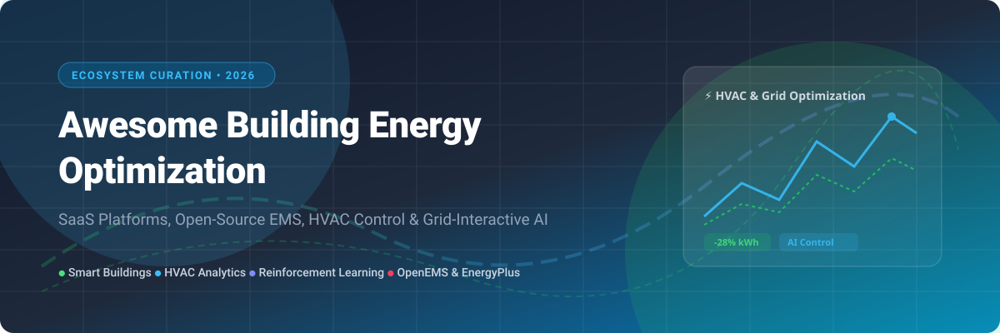

# Awesome Building Energy Optimization 🏢⚡

  

  
  
  
  
  

---

## 💡 Overview & Top Building Energy Optimization Ecosystem

**Curated List of SaaS Products & Open-Source GitHub Projects**  
*Focused on Building Automation, Energy Analytics, HVAC Control & Grid-Interactive Efficiency* 📈  
**Last updated: September 2026**

This repository tracks notable **SaaS platforms** and **open-source software** for **Building Energy Optimization (BEMS)**. These tools monitor, analyze, and optimize building energy consumption, HVAC performance, peak load demand response, and grid interactivity for commercial buildings, campuses, microgrids, and distributed energy resources (DERs).

**SaaS Category Leaders** include BrainBox AI, 75F, GridPoint, CopperTree Analytics, Clockworks Analytics, Facilio, Switch Automation, Aquicore, Enertiv, and Spacewell Dexma.

**Open-Source Emphasis**: This section is expanded with active GitHub projects for self-hosting, custom building automation, and transparent energy data management — ideal for building engineers, facility managers, researchers, and developers building vendor-independent energy optimization solutions. The open-source ecosystem offers production-grade Energy Management Systems (EMS) and research platforms for reinforcement learning and model predictive control. 🤖⚡

---

## 📜 Table of Contents
- [🏢 SaaS/Hosted Platforms](#-saashosted-platforms)
- [🔓 Open-Source GitHub Projects](#-open-source-github-projects)
- [🤝 How to Contribute](#-how-to-contribute)
- [💖 Support & Sponsorship](#-support--sponsorship)
- [📈 Star History](#-star-history)
- [⚠️ Disclaimer](#%EF%B8%8F-disclaimer)

---

## 🏢 SaaS/Hosted Platforms

> [!NOTE] **Market Dynamics & Sector Structure** 📊  
> The global Building Energy Management Systems (BEMS) and Software market is valued at **~$10.3B – $18.6B** (2024–2026) and is projected to reach **$31B – $40B+ by 2030–2032** at a **CAGR of ~9.4% – 13.2%**.  
> The market is **highly fragmented**, comprising industrial automation conglomerates (Siemens, Schneider Electric, Honeywell), specialized IoT/BMS providers, and cloud-native AI SaaS startups. No single SaaS vendor exercises monopoly power ("winner-take-all"), enabling continuous innovation across automated fault detection (FDD), reinforcement learning HVAC control, and portfolio ESG analytics.

| Company / Product | Platform Overview | Pricing Model (Starting Tier) | Free Tier / Trial Limits | Company Size / Valuation & Funding |
| :--- | :--- | :--- | :--- | :--- |
| **[Spacewell Dexma](https://www.spacewell.com/)** 🏢 | Energy management software for portfolio-wide energy monitoring, targeting, and analytics. | Quote-based custom tier (starting ~$5,000/year enterprise) | No free perpetual plan; 15-day limited feature demo trial | **Nemetschek Group Subsidiary** (€995.6M consolidated 2024 revenue; Dexma acquired 2020) |
| **[BrainBox AI](https://www.brainboxai.com/)** 🧠 | AI-powered autonomous HVAC optimization using deep learning to cut emissions and energy costs. | Custom per-sq-ft quote ($0.10–$0.20/sq ft/yr est.) | No free perpetual plan; 30-day piloted site assessment trial | **Trane Tech Subsidiary** ($100M+ funding raised prior to acquisition by Trane Technologies in Jan 2025) |
| **[GridPoint](https://www.gridpoint.com/)** ⚡ | Building energy management system with demand response, submetering, and peak load optimization. | Quote-based EMaaS ($250–$500/month/location contract) | No free perpetual plan; 14-day guided proof-of-concept trial | **$584M Total Funding** ($39.7M ARR est.; $45M Series F raised March 2025) |
| **[Aquicore](https://www.aquicore.com/)** 📊 | Portfolio ESG reporting, asset management, and real-time utility monitoring for commercial real estate. | Custom quote-based (starting ~$15,000/year per building) | No free perpetual plan; 14-day sales-assisted portfolio evaluation trial | **$43M Acquisition Value** (Acquired by Infogrid in 2022; $54.6M total funding raised) |
| **[Clockworks Analytics](https://www.clockworksanalytics.com/)** 🔍 | Automated Fault Detection and Diagnostics (FDD) for enterprise HVAC systems and facility teams. | Custom quote-based (starting ~$12,000/year building tier) | No free perpetual plan; 30-day pilot trial on sample building data | **$35M Total Funding** (~$14M ARR est.; $16.1M growth round raised Aug 2023) |
| **[75F](https://www.75f.io/)** 🌡️ | IoT-based smart building management system for HVAC, IAQ, and lighting automation. | ~$0.15 – $0.25 / sq ft / year subscription | No free perpetual plan; 90-day trial for Facilisight Pro module | **$28M+ Total Funding** (Series A led by Breakthrough Energy Ventures & Siemens) |
| **[Facilio](https://facilio.com/)** 🏙️ | Connected building operations platform integrating energy analytics, maintenance, and IoT control. | Tiered custom seats (Standard tier starts ~$25,000/year) | No free perpetual plan; 14-day interactive sandbox demo trial | **$22.5M Total Funding** (Series B led by Dragoneer Investment Group & Tiger Global) |
| **[Enertiv](https://www.enertiv.com/)** 🔋 | Real-time energy monitoring, equipment health analytics, and submetering for real estate portfolios. | Cents/sq ft (Commercial) or $1–$3/unit/mo (Multifamily) | No free perpetual plan; 14-day pilot project data trial | **$18.4M Total Funding** ($5.7M annual revenue est.; $9M Series A raised) |
| **[CopperTree Analytics](https://www.coppertreeanalytics.com/)** 📈 | Kaizen building analytics platform for HVAC energy efficiency and automated fault detection. | Custom quote-based ($0.05–$0.15/sq ft/yr est.) | No free perpetual plan; 30-day pilot deployment trial | **Sidara Subsidiary** (Acquired by Sidara / Dar Group in March 2023) |
| **[Switch Automation](https://www.switchautomation.com/)** 🎛️ | Smart building IoT platform for energy monitoring, fault detection, and ESG sustainability reporting. | Enterprise quote-based (starting ~$10,000/year portfolio) | No free perpetual plan; 14-day customized demo trial | **~$12M Total Funding** (Private entity specializing in commercial smart buildings) |

---

## 🔓 Open-Source GitHub Projects

Below is a curated list of leading open-source building energy optimization software, energy management systems (EMS), and simulation frameworks, **sorted by GitHub Stars_Count** 🌟.

1. **[EnergyPlus](https://github.com/NREL/EnergyPlus)**  🌟  
   The flagship open-source whole-building energy simulation engine funded by the U.S. Department of Energy (DOE). Models energy, heating, cooling, ventilation, lighting, and water usage in commercial and residential buildings.

2. **[OpenEMS](https://github.com/OpenEMS/openems)**  🌟  
   The leading open-source Energy Management System (EMS) platform with 10+ years of development history. Java/OSGi-based, hardware-agnostic framework running on Raspberry Pi, mini-PCs, or embedded systems. Integrates battery storage, EV charging control (EVSE), heat pumps, and grid time-of-use optimization.

3. **[CityLearn](https://github.com/intelligent-environments-lab/CityLearn)**  🌟  
   An OpenAI Gym / Gymnasium environment for reinforcement learning research in building energy management and demand response coordination. An official LF Energy project supporting microgrid, HVAC, PV, battery, and EV fleet modeling.

4. **[GridLAB-D](https://github.com/gridlab-d/gridlab-d)**  🌟  
   Flexible agent-based power distribution system simulation environment developed by Pacific Northwest National Laboratory (PNNL) to study grid interactions with smart buildings, DERs, and energy storage.

5. **[BOPTEST](https://github.com/ibpsa/project1-boptest)**  🌟  
   Building Optimization Performance Test framework developed by IBPSA for benchmarking advanced HVAC control strategies. Containerized emulators with standardized KPIs for fair performance comparisons.

6. **[BAC0](https://github.com/ChristianTremblay/BAC0)**  🌟  
   Python library designed to simplify interaction with BACnet building automation controllers. Widely used by building engineers for scripting automated control sequences and collecting HVAC sensor data.

7. **[ECLIPSE VOLTTRON](https://github.com/eclipse-volttron/volttron)**  🌟  
   An open-source, agent-based distributed sensing and control platform for building automation, grid-interactive efficient buildings (GEB), and transactive energy management systems.

8. **[TEASER](https://github.com/RWTH-EBC/TEASER)**  🌟  
   Tool for Energy Analysis and Simulation for Efficient Retrofit. Python library for rapid generation of building archetype energy models compliant with VDI 6007-1.

9. **[urbs](https://github.com/tum-ens/urbs)**  🌟  
   Open-source linear optimization model for distributed energy system planning and operational decision support across multi-carrier urban energy networks.

10. **[Energym](https://github.com/ugr-sail/energym)**  🌟  
    Python framework for benchmarking reinforcement learning building control algorithms in standardized EnergyPlus and Modelica building environments.

11. **[PyCity](https://github.com/RWTH-EBC/pycity)**  🌟  
    Python-based simulation platform for urban district energy flow modeling and integrated city-scale energy optimization.

12. **[MPCPy](https://github.com/MPC-Lab/mpcpy)**  🌟  
    Model Predictive Control (MPC) toolbox for building energy systems, supporting custom data-driven and physical modeling for individual facility optimization.

13. **[MuFlex](https://github.com/BuildNexusX/MuFlex)**  🌟  
    Scalable co-simulation platform for multi-building flexibility coordination across EnergyPlus and Modelica models using Gymnasium interfaces.

14. **[OGEMA 2.0](https://github.com/ogema)** 🇩🇪  
    Open-source Energy Management Framework developed by Fraunhofer IWES, IIS, and ISE. Hardware-independent Java platform for microgrid, PV, and HVAC automation.

15. **[SimStadt](https://github.com/SimStadt)** 🏙️  
    3D urban energy simulation software for neighborhood heat demand and solar potential assessment based on CityGML 3D building models.

16. **[eNeuron](https://github.com/eNeuron-project)** 🇪🇺  
    Open-source tool for optimizing multi-carrier local energy communities and integrated energy hubs.

---

## 🤝 How to Contribute

Contributions are welcome and greatly appreciated! 💖

1. Fork the Repository.
2. Add your SaaS product or Open-Source project to `README.md` following the tabular or starred format.
3. Ensure description links are functional and accurate.
4. Submit a Pull Request (PR) with a brief summary of additions.

---

## 💖 Support & Sponsorship

If you find this curated ecosystem list helpful for your building energy research, facility engineering, or SaaS discovery, please consider supporting the project! 🌟

- ⭐ **Star this repository** to help others discover it.
- 🔀 **Fork and share** with building engineers and energy analysts.
- ☕ **Buy me a coffee / Sponsor**: Support ongoing maintenance on GitHub Sponsors:  
  👉 **[Sponsor Dashboard on GitHub](https://github.com/sponsors/ishandutta2007)** 💖

---

## 📈 Star History

---

## ⚠️ Disclaimer

- This is a **community-curated list** — not exhaustive and not an endorsement.
- Building energy optimization tools must comply with local building codes, energy regulations, and grid interconnection standards.
- Self-hosted open-source solutions require proper infrastructure, expertise in building automation protocols (Modbus, MQTT, KNX, BACnet), and ongoing maintenance.

---

**Made with ❤️ for building engineers, facility managers, energy analysts, and smart building developers.**
